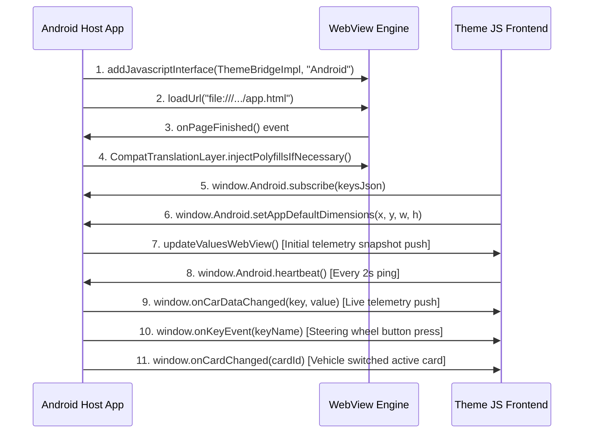

# Theme Development & Customization Guide

This guide explains how to create, build, and deploy custom themes for the Haval Impuse app. In this decentralized architecture, **themes are completely self-contained applications** that run inside a WebView, receive raw steering wheel keypress events, and dynamically subscribe to car telemetry. 

There are **no hardcoded screens on the Android backend**—the frontend theme HTML/JS/CSS completely defines all screens, transitions, and menus, allowing theme authors to design **unlimited custom screens** (e.g. Main Menu, AC, Regeneration, Trip Stats, Tyre Pressures, Ambient Lighting, or custom Graphics screens).

---

## Table of Contents
1. [Decentralized Theme Architecture](#decentralized-theme-architecture)
2. [Three-Tier Customization Model](#three-tier-customization-model)
3. [Package Structure](#package-structure)
4. [Theme Metadata & Manifests](#theme-metadata--manifests)
5. [Native masks (covering OEM chrome)](#native-masks-covering-oem-chrome)
6. [The JavaScript Bridge & Primitives](#the-javascript-bridge--primitives)
7. [Development Workflow & Local Simulation](#development-workflow--local-simulation)
8. [Build, Inlining & Deployment](#build-inlining--deployment)

---

> **System docs:** host layout, APK vs OTA deploy, and compatibility policy live in
> [`docs/architecture/themes-contract-v1.md`](../../docs/architecture/themes-contract-v1.md).
> Keep API/authoring details in this guide; keep system/deploy rules there.

## Decentralized Theme Architecture

Themes are designed as self-contained modular applications built on two main concepts:
- **Source Modularity, Compile-Time Inlining**: You write modular JavaScript (using imports from shared packages) and standard CSS. The build pipeline bundles, minifies, and base64-inlines everything (including fonts and assets) into a **single self-contained `app.html`** file with zero external HTTP requests.
- **Client-Driven Subscriptions**: To maximize performance and battery, your theme explicitly tells the Android backend which CAN-bus keys it wants to monitor via `Android.subscribe(keysJson)`. The backend streams updates only for those keys.
- **Raw Event Processing**: The backend dispatches physical steering wheel buttons as raw strings (`'UP'`, `'DOWN'`, `'ENTER'`, `'BACK'`, `'ENTER_LONG'`, etc.) directly to `window.onKeyEvent(key)`. Your theme owns the navigation logic entirely.

---

## Three-Tier Customization Model

To provide both lightning-fast development and infinite creative freedom, you can build themes using three distinct layers:

### Level 1 — Manifest Only (Zero JS Customization)
If you only want to customize menu lists, columns, or setting values, you don't need to write any Javascript. Define your grid columns and cycling behaviors inside the theme's manifest, and write standard HTML referencing item IDs:

```json
// manifest.json or theme.xml
{
  "menu": [
    { "id": "esp",         "action": "cycle",    "key": "CAR_DRIVE_SETTING_ESP_ENABLE",        "values": ["0", "1"] },
    { "id": "evMode",      "action": "cycle",    "key": "CAR_EV_SETTING_POWER_MODEL_CONFIG",   "values": ["3", "1", "0"] },
    { "id": "ac",          "action": "navigate", "screen": "aircon" },
    { "id": "trip",        "action": "navigate", "screen": "tripStats" }
  ],
  "layout": "grid",
  "gridColumns": 2
}
```

```html
<!-- HTML Structure -->
<div class="menu-grid">
  <div class="menu-tile" data-menu-id="esp"></div>
  <div class="menu-tile" data-menu-id="evMode"></div>
  <div class="menu-tile" data-menu-id="ac"></div>
  <div class="menu-tile" data-menu-id="trip"></div>
</div>
```
The headless `MainMenu` component in the runtime automatically registers focus, moves active `.is-focused` styles using keyboard events, and writes settings back to the car.

### Level 2 — Custom Render Callback
If you want animated focus indicators or custom DOM structures while retaining automatic cycling and key traversal logic, pass a custom render function:

```javascript
import { createMainMenu } from "@cluster/shared/mainMenu";

createMainMenu({
  items: manifest.menu,
  container: document.querySelector(".menu-grid"),
  renderItem: (item, state) => `
    <div class="tile ${state.focused ? 'focused' : ''}">
      <span class="label">${state.currentLabel}</span>
    </div>
  `
});
```

### Level 3 — Full Override (Total Freedom)
For highly non-linear, radial, or gesture-driven UI designs, ignore the prebuilt components and import our core reactive primitives to craft your own logic:

```javascript
import { useFocusCycle, useValueCycle, bridge } from "@cluster/shared/runtime";

class RadialDialController {
    constructor() {
        this.focus = useFocusCycle(["esp", "evMode", "ac"], { namespace: "radial" });
    }
    handleKey(keyName) {
        if (keyName === 'LEFT') this.focus.prev();
        if (keyName === 'RIGHT') this.focus.next();
    }
}
```

---

## Package Structure

A finished theme package consists of a folder structured as follows:

```text
Themes/MyCustomTheme/
├── theme.xml        # Core metadata (name, minBridgeVersion, nativeMasks, …)
├── manifest.json    # Level 1 menu and grid configurations (optional)
├── thumbnail.png    # 200x200px dashboard preview image
├── app.html         # The compiled, fully self-contained bundle
├── car-bg.png       # Recommended wallpaper (Display 1 / mask composite)
└── d3_mask.png      # Optional global alpha mask for Display 3 native layer
```

---

## Theme Metadata & Manifests

### 1. The `theme.xml` Configuration
The metadata file tells the launcher how to identify and validate your theme:

```xml
<theme>
    <name>Sports Radial</name>
    <description>Vibrant neon instrumentation dials with radial grid layouts.</description>
    <version>1.2.0</version>
    <minBridgeVersion>1.0.0</minBridgeVersion>
    <contractVersion>v1.0</contractVersion>
    <thumbnail>thumbnail.png</thumbnail>
    <mainFile>app.html</mainFile>
</theme>
```

* **`<minBridgeVersion>`**: Required. Specifies the minimum Android JavaScript Bridge API version required (`1.0.0` for current standardized bridge, `0.1.0` for legacy bridge).
* **`<contractVersion>`**: Required. Specifies the telemetry schema and layout contract (`v1.0`).

### 2. User Settings (`<configurations>`)

Anything you declare here becomes a control in the app's theme settings dialog, with no
native code required. Values reach your theme through the ordinary `getPreference` path
under the `stateVariable` name.

```xml
<configurations>
    <configuration>
        <id>accent_color</id>
        <label>Cor de Destaque</label>
        <type>color</type>
        <options>#00A0FF, #FF0033, #00E676</options>
        <default>#00A0FF</default>
        <stateVariable>accentColor</stateVariable>
        <group>Cores</group>
    </configuration>
</configurations>
```

| Field | Notes |
|---|---|
| `<type>` | `boolean`, `text`, `number`, `combo`, `color` |
| `<options>` | Comma-separated. Choices for `combo`; preset swatches for `color`. Ignored otherwise. |
| `<default>` | Always a string. For `color`, must be `#RRGGBB`. |
| `<stateVariable>` | The name your JS reads. Scoped per theme internally, so two themes may reuse a name safely. |
| `<group>` | **Optional.** Tab this setting appears under. |

**Groups / tabs.** `<group>` only organises the dialog — it carries no runtime meaning and
never reaches your JavaScript.

* Omit it (or leave it blank) and the setting lands in **`Geral`**.
* **`Geral` is always the first tab.** Other tabs follow the order their name first appears
  in the file.
* If everything resolves to one group, the tab row is not drawn at all — so themes written
  before groups existed look exactly as they always did.
* Names are matched verbatim: `Cores` and `cores` would become two separate tabs.

Both `<group>` and the `color` type are additive extensions of the `v1.0` contract; older
app builds ignore them and fall back to the declared `<default>`.

---

## Native masks (covering OEM chrome)

### Why they exist

The instrument cluster is not one blank canvas. OEM graphics (fuel/battery bars, speedo-side
chrome, top-center strip, etc.) sit in the physical / compositor stack **around and under**
the Display‑3 WebView. A theme that only draws inside the WebView cannot paint over those
regions — so gauges and strips stay visible and fight the custom UI.

**Native masks** let the **Android host** draw opaque rectangles (and optional bitmaps) in
those regions on Display 3, composited with the theme wallpaper. That covers the stock
cluster chrome so the WebView theme can own the look end-to-end.

```text
┌──────────────────────── Display 3 (cluster) ────────────────────────┐
│  OEM gauges / strips (always there underneath)                      │
│  ┌─ Native mask layer (Android ImageViews + optional d3_mask.png) ─┐│
│  │  Covers fuel / battery / top strip / optional side covers       ││
│  │  ┌─ Hole punched when AA/CarPlay/app is on D3 ─────────────────┐││
│  │  │  Projection visible through the hole                        │││
│  │  └─────────────────────────────────────────────────────────────┘││
│  └─────────────────────────────────────────────────────────────────┘│
│  WebView theme (app.html) — free to design without fighting OEM UI  │
└─────────────────────────────────────────────────────────────────────┘
```

When an app (Android Auto / CarPlay / map) is on Display 3, the host **punches a hole** in
the mask layer for that app’s rectangle so projection is not buried under the wallpaper
masks. The WebView stays; only the mask layer is cut.

### Declaring masks in `theme.xml`

```xml
<!-- Prefer a theme <background> wallpaper — masks composite against it. -->
<background>car-bg.png</background>

<nativeMasks>
    <fuelMask enabled="true" x="0" y="653" width="730" height="67" />
    <batteryMask enabled="true" x="1190" y="653" width="730" height="67" />
    <topCenterMask enabled="true" x="710" y="0" width="500" height="67" />
    <!-- Optional full-height side covers (usually leave off): -->
    <!-- <speedMask enabled="false" x="0" y="0" width="600" height="720" /> -->
    <!-- <infoMask enabled="false" x="1320" y="0" width="600" height="720" /> -->
</nativeMasks>
```

| Child | Typical use |
|---|---|
| `fuelMask` | Cover OEM fuel / left bottom gauge strip |
| `batteryMask` | Cover OEM battery / right bottom gauge strip |
| `topCenterMask` | Cover OEM top-center info strip |
| `speedMask` | Optional left full-height cover |
| `infoMask` | Optional right full-height cover |

Coordinates are in the **1920×720** cluster space. Each child supports `enabled`, `x`, `y`,
`width`, `height`, and optionally `image` / `opacity` (parsed by `ThemeManager`).

- Omit `<nativeMasks>` (or disable every child) → leave OEM chrome visible.
- Geometry is theme-specific (Minimalist’s values are a good starting point).
- Without a wallpaper, masks look wrong — ship `<background>` / `car-bg.png`.
- Optional package file `d3_mask.png`: global alpha mask used when composing the Display‑3
  wallpaper layer (see `InstrumentProjector2`).

### Runtime control from JS

| Function | Direction | Description |
|---|---|---|
| `setNativeMaskState(maskName, visible)` | JS → Host | Show/hide one named mask (`fuelMask`, `batteryMask`, …). |
| `setNativeMasksConfig(jsonConfig)` | JS → Host | Push a JSON override for mask config (advanced). |

System overview: [`docs/architecture/themes-contract-v1.md`](../../docs/architecture/themes-contract-v1.md).

---

## Architectural Separation: Bridge Version vs. Contract Version

* **Bridge Version (`minBridgeVersion` / `CURRENT_BRIDGE_VERSION = "1.0.0"`)**:
  - Defines the **native Java/Kotlin API capabilities** exposed to WebView JS via `window.Android`.
  - Controls whether methods like `window.Android.subscribe()`, `setClusterBackground()`, or `launchApp()` exist.
  - Backward compatibility is maintained dynamically via JS polyfills in `CompatTranslationLayer.kt`.
* **Contract Version (`contractVersion = "v1.0"`)**:
  - Defines the **telemetry data key dictionary** (`car.basic.vehicle_speed`), steering key event protocol (`'UP'`, `'DOWN'`, `'ENTER'`, `'BACK'`), and layout rules.
  - Used by `ThemeManager.kt` and `TelasScreen.kt` to ensure only compatible themes are displayed in the Telas tab.

---

## The JavaScript Bridge & Primitives

Theme interactions occur via the global `window.Android` namespace and standard reactive hooks.

### Complete Bridge Function Reference (`v1.0` / `1.0.0`)

| Category | Function | Direction | Description |
| :--- | :--- | :--- | :--- |
| **Diagnostics** | `heartbeat()` | JS → Host | Periodic ping (every 2s) to signal WebView renderer liveness. |
| **Diagnostics** | `getAvailableKeys(): String` | JS → Host | Returns JSON array of all supported CAN-bus/app telemetry keys. |
| **Telemetry** | `subscribe(keysJson: String)` | JS → Host | Subscribes theme to live CAN-bus streaming for JSON array of keys. |
| **Telemetry** | `unsubscribe(keysJson: String)` | JS → Host | Unsubscribes theme from telemetry updates. |
| **Telemetry** | `getCarData(key: String): String` | JS → Host | Synchronously reads current cached telemetry value for a key. |
| **Telemetry** | `updateCarData(key: String, val: String)` | JS → Host | Sends CAN-bus setting command back to vehicle hardware. |
| **Layout & Cutouts** | `setAppDefaultDimensions(x, y, w, h)` | JS → Host | Informs Android of theme canvas bounds for CarPlay/AA cutouts. |
| **Layout & Cutouts** | `setWarningActive(isActive: Boolean)` | JS → Host | Toggles cluster warning banner overlay state. |
| **Native masks** | `setNativeMaskState(maskName, visible)` | JS → Host | Show/hide a Display‑3 OEM-cover mask (`fuelMask`, …). |
| **Native masks** | `setNativeMasksConfig(jsonConfig)` | JS → Host | Advanced JSON override for native mask geometry/state. |
| **Wallpaper** | `setClusterBackground(type, val)` | JS → Host | Sets Display-1 cluster background (`THEME`, `PRESET`, `IMAGE_URL`, `FILE`, `COLOR`). |
| **Wallpaper** | `setThemeBackground(relativePath)` | JS → Host | Registers theme package wallpaper asset (e.g. `car-bg.png`). |
| **Preferences** | `savePreference(key, val)` | JS → Host | Persists theme-scoped user configuration. |
| **Preferences** | `getPreference(key, defaultVal): String` | JS → Host | Reads theme-scoped user configuration. |
| **Preferences** | `saveSetting(key, val)` | JS → Host | Saves cluster display setting. |
| **System Actions** | `triggerSystemAction(action, payload)` | JS → Host | Triggers vehicle action (`CANCEL_MAX_AC`, `TRIGGER_AVM_CAMERA`, `BRING_ALL_TO_MAIN`). |
| **Multi-Display** | `launchApp(packageName, displayId)` | JS → Host | Launches target Android app on main or cluster display. |
| **Multi-Display** | `killApp(packageName)` | JS → Host | Kills target Android app process. |

### Lifecycle Execution Sequence



Note the direction of step 11: card changes originate in the vehicle, not in the theme and
not in the host. LEFT/RIGHT wheel presses are consumed by the vehicle's own cluster
navigation and never reach step 10.

### Reacting to Backend Pushes
Exposed globally in the window scope:
* **`window.onKeyEvent(keyName)`**: Triggered on physical wheel inputs (`'UP'`, `'DOWN'`, `'ENTER'`, `'BACK'`, `'HOME'`, `'ENTER_LONG'`, `'BACK_LONG'`).
  **`LEFT` and `RIGHT` are never delivered.** They are reserved for cluster card
  navigation, which the vehicle performs itself; the host deliberately withholds them so a
  theme cannot fight the car for card control. A theme needing a two-way toggle should use
  `ENTER` (as the Default theme's AC screen does for fan/temp focus).

  **Common `ENTER_LONG` patterns (v1.0 themes):**
  - **One-Pedal** — `car.ev.setting.pedal_control_enable` (`0`/`1`). Long-press while focused
    on Regeneração enables it; when active, short or long ENTER disables and restores the
    previous `car.ev_setting.energy_recovery_level`. Subscribe + seed from card entry /
    `getCarData` (there is no OEM push path outside `subscribe`).
  - **HEV energy reserve** — only when `car.ev_setting.power_model_config == 0` (HEV).
    Long-press on Modo EV toggles `car.ev_setting.power_reserve_config` (`1` Inteligente ↔
    `2` Prioritário). Show SOC from `car.ev_setting.charge_soc_target_config` (20–80) in the
    Prioritário sublabel. Compose the label in theme JS — do **not** expect the host to stuff
    `"HEV Inteligente"` into the `evMode` friendly key (that stays raw `0`/`1`/`3`).
* **`window.onDataChanged(key, value)`**: Triggered when a subscribed telemetry key emits a new value.
* **`window.onCardChanged(cardId)`**: Fired when the active cluster card changes
  (0 = Hidden, 1 = Main Widgets, 3 = AC). **Required — every v1.0 theme must implement it.**
  This is the single channel by which a theme learns the active card, and it is one-way:
  the card is owned by the vehicle and flows car → host → theme. There is deliberately no
  reverse channel; a theme must never report a card back to the host.

  **`onCardChanged` must be the only writer of the card in your theme's state.** A static
  initial value is fine, but nothing else may assign it — in particular, never re-seed the
  card from the host during an async init:

  ```javascript
  // WRONG. Do not do this, in any form.
  const initialCardId = Number(bridge.getCarData('cardId')) || 1;
  setState('cardId', initialCardId);
  ```

  The host pushes `onCardChanged` on page load as well as on every change, so there is
  nothing to seed. Any second writer is a race you will lose: async init resolves *after*
  the page-load push, so it silently overwrites the real card. (The reader above is also
  the legacy `control('cardId', …)` channel, which the host no longer feeds — and `|| 1`
  maps card 0 to 1, because `Number('0')` is falsy.)

  Pick your static initial `cardId` and initial `screen` as a **matched pair** — the
  initial screen must be that card's root screen (currently `cardId: 1` ↔
  `screen: 'main_menu'`). State setters are change-gated, so when the car is already on
  the initial card the push is a no-op and no subscriber fires; if the pair disagreed,
  nothing would ever correct it.

  **Do not navigate away from a card's root screen.** Whatever screen you show for a card
  is that card's root, not somewhere the theme navigated to, so there is nothing for
  `BACK` to go back to — and leaving strands the theme on an unrelated screen while the
  car is still on that card. Exclude those screens explicitly:

  ```javascript
  // 'aircon' is card 3's root screen: BACK must not force it away.
  if (keyName === 'BACK' && screen !== 'main_menu' && screen !== 'aircon') {
      setState('screen', 'main_menu');
  }
  ```

  This matters more than it looks, because `BACK` is also how the driver dismisses a
  cluster warning. Those presses arrive at your key handler with no navigation intent
  behind them, so an unguarded `BACK` handler fires on any warning raised while the card
  is active — not just when the driver means to go back.

  Note that `cardId` is **not** a 1:1 map of what the cluster is displaying. Card 0 has
  vehicle-state-dependent sub-pages (two of them while the car is charging), and every one
  of them reports `cardId` 0. A theme must therefore not infer a card ordering, assume a
  fixed rotation, or treat "same `cardId` as before" as "nothing changed on the cluster".

  **A theme must ignore wheel input while `cardId` is 0.** Card 0 is the vehicle's own
  card; your theme is not what the driver is looking at. `onKeyEvent` still fires — the
  host forwards wheel input unconditionally, because the theme owns its navigation logic
  and gating it host-side would put card semantics in two places. Acting on those presses
  is therefore a theme bug, and not a harmless one: several theme controls write to the
  CAN bus, so a theme that keeps handling `UP`/`DOWN` on card 0 will change vehicle state
  (this was observed raising the AC fan while the driver was on the native card).

---

## Development Workflow & Local Simulation

You don't need a real car or an Android device to build your themes. The local development environment comes with a fully-featured **Local Keyboard & Telemetry Simulator**:

1. **Local Boot**: From your theme's folder, run:
   ```bash
   npm run dev-controls
   ```
2. **Local Simulation**:
   * Opens a hot-reloading development server in your browser.
   * Desktop arrow keys automatically map to steering wheel inputs:
     * `ArrowUp` / `ArrowDown` &rarr; `UP` / `DOWN`
     * `Enter` &rarr; `ENTER`
     * `Shift+Enter` &rarr; `ENTER_LONG` (One-Pedal / HEV reserve, etc.)
     * `Escape` / `Backspace` &rarr; `BACK`
     * `Shift+Backspace` &rarr; `BACK_LONG`
   * Stubbed `Android.subscribe` and `updateCarData` APIs allow you to view data changes directly in your browser's Developer Tools Console in real-time.

---

## Build, Inlining & Deployment

### 1. The Build Command
To compile your modular theme into a single bundle:
```bash
npm run build
```
This runs `parcel build` and executes `inline.js` to create a self-contained `app.html` inside the `dist/` directory.

### 2. Where the build lands (Default vs dynamic / OTA)

| Theme type | Example | `npm run build` destination |
|---|---|---|
| **Default (APK-bundled)** | `source/v1.0/default/` | `app/src/main/res/raw/app.html` + `app/src/main/assets/Default/theme.xml` |
| **Dynamic / OTA** | `source/v1.0/minimalist/` | `cluster-widgets/Themes/v1.0/<theme>/app.html` **and** `theme.xml` |

For OTA themes, `theme.xml` **must** be copied with `app.html`: the host compares `<version>` in that XML to decide whether an update is available. Shipping a new `app.html` beside a stale `theme.xml` means the car never picks up the change.

The release branch crawled by the in-app catalog is configured in `ThemeManager.kt` (currently `feature/new-screen-enhancements-v7`).

### 3. Submitting / updating an OTA theme
1. Bump `<version>` in the theme's source `theme.xml`.
2. Run `npm run build` in the theme source folder (copies minified HTML + config XML into `Themes/`).
3. Commit and push source **and** `cluster-widgets/Themes/v1.0/<theme>/` to the release branch.
4. The launcher crawls that branch and populates compatible themes on the **Telas** screen.

---

## Unlimited Custom Screens & Navigation

Because the native backend is completely decentralized, the theme frontend functions as a modern Single-Page Application (SPA) where the state variable `screen` controls the layout. Developers can create unlimited high-fidelity custom views (e.g. tyre pressure panels, ambient lighting controls, trip computer statistics, secondary menus) without touching the native Android application or writing complex event-routing boilerplate.

### 1. Screen Cache vs. Dynamic Lifecycle
To optimize memory and performance on low-resource head units, the rendering pipeline categorizes screens:
* **Cached Screens** (e.g., `'main_menu'`, `'aircon'`): Initialized once at boot time. They remain in the DOM and are simply toggled between `display: 'block'` and `display: 'none'` for instant response.
* **Dynamic Screens** (e.g., `'regen'`, `'display_selection'`, `'graph'`): Instantiated on the fly when navigated to, and **fully destroyed and garbage-collected** when navigated away.

### 2. How to Build a Custom Screen (Example: Tyre Pressure)

#### Step A: Create the Component
Create a new file in your theme source (e.g., `src/core/components/tirePressure.js`). Export a factory function returning the root DOM element and a critical `cleanup` hook:

```javascript
import { getState, subscribe } from '../state.js';
import { div, span } from '../../../../shared/utils/createElement.js';

export function createTirePressureScreen() {
    const container = div({ className: 'tire-pressure-container' });
    const title = span({ className: 'screen-title', children: ['Tire Pressure'] });
    container.appendChild(title);

    const subscriptions = [];

    // Subscribe to telemetry states reactively
    subscriptions.push(subscribe('frontLeftTirePressure', (pressure) => {
        // Smoothly update the visual layout
    }));

    // Cleanup hook - critical to prevent memory leaks and background CPU cycles
    const cleanup = () => {
        subscriptions.forEach(unsubscribe => unsubscribe());
    };

    return { element: container, cleanup };
}
```

#### Step B: Register the Screen in the Main Renderer
1. Import your factory in `main.js`:
   ```javascript
   import { createTirePressureScreen } from './components/tirePressure.js';
   ```
2. In the dynamic screen rendering block within `render()` in `main.js`, add a route handler:
   ```javascript
   } else if (screen === 'tire_pressure') {
       componentResult = createTirePressureScreen();
   }
   ```

#### Step C: Hook Key and Steering Wheel Inputs
Add a key handler block inside the steering wheel listener in `main.js`:
```javascript
} else if (screen === 'tire_pressure') {
    if (keyName === 'BACK') {
        setState('screen', 'main_menu'); // Smoothly navigate back
    }
}
```

> `BACK → main_menu` is correct here only because `tire_pressure` is a screen the theme
> navigated *to*, from card 1's menu. Never write this for a screen a card owns — see
> "Do not navigate away from a card's root screen" above.

#### Step D: Link from the Declarative Menu
1. **Visual Declaration** in `mainMenu.js`:
   ```javascript
   { id: 'option_8', label: 'Pneus', iconSrc: iconTires },
   ```
2. **Behavioral Declaration** in `main.js` under `manifest.menu`:
   ```javascript
   { id: 'option_8', action: 'navigate', screen: 'tire_pressure' }
   ```
   
The routing engine automatically maps focus transitions, carousel scroll positions, keyboard selection triggers, and subscription states cleanly.


